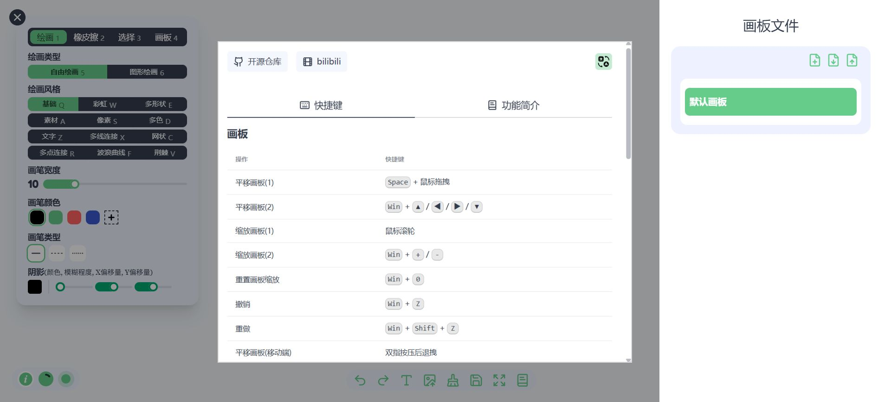

# Paint Board 画板

一款在线绘画工具。

+ 绘画模式
  - 自由绘画
    - 提供了 12 种不同风格的画笔，包括基本画笔，彩虹画笔，多形状画笔，多素材画笔，像素画笔，多色画笔，文字画笔，多线连接画笔，网状画笔，多点连接画笔，波浪曲线画笔，荆棘画笔。以满足多样化的绘画需求。
    - 所有画笔均支持颜色和画笔宽度的配置，另外多形状、多素材、多色等画笔支持定制化配置。
  - 形状绘制
    - 提供了多种常见形状的绘制,并支持多端点线段以及箭头,并且这些形状均支持边框和填充的样式配置。
+ 橡皮擦模式
  - 橡皮擦模式可线性擦除所有内容，并支持线性宽度配置。
+ 选择模式
  - 在选择模式下，可以通过点击绘画内容进行框选。点击手柄支持拖拽、缩放和旋转操作，提供灵活的编辑方式。
  - 选择图片支持多种滤镜配置。
  - 选择文字时，支持字体和样式设置。
  - 所有绘制内容均支持图层设置，包括向上移动层级、向下移动层级、移动至顶层和移动至底层。
  - 所有绘制内容支持透明度配置。
  - 所有绘制内容支持橡皮擦是否可擦除配置。
+ 画板配置
  - 画板支持配置背景配置, 包括颜色, 背景图, 透明度。
  - 画板支持自定义宽高配置。
  - 支持绘画缓存，在存在大量绘制内容的情况下，启用缓存将提高绘制性能，而禁用缓存则会提升画布清晰度。
  - 新增辅助线绘制功能。
+ 多功能菜单
  - 左下角按钮实时显示当前缩放比例，点击即可重置缩放比例。
  - 中间按钮列表按从左到右的功能分别为：撤销、反撤销、复制当前选择内容、删除当前选择内容、绘制文字、上传图片、清除绘制内容、保存为图片、打开文件列表。  
    - 上传图片支持去除背景, 图像分割. 此功能需要浏览器支持WebGPU
    - 保存为图片支持自定义配置. 旋转, 缩放, 裁切
  - 电脑端：
    - 按住 Space 键并点击鼠标左键可移动画布，滚动鼠标滚轮实现画布缩放。
    - 按住 Backspace 键可删除已选内容。
    - 同时按住 Ctrl 键 + V 键可粘贴剪贴板图片。
  - 移动端：
    - 支持双指按压后拖拽和缩放画布。
+ 多文件配置
  - 支持多个画布切换，每个画布可自定义标题、增加、删除，并提供上传和下载功能。
+ 国际化
  - 支持中文(简体), 中文(繁体), English, 日本語, 한국어。
+ 支持 PWA, 可离线访问

- 原项目地址
  - 官网 https://songlh.top/paint-board
  - GitHub仓库 https://github.com/LHRUN/paint-board
- 我汉化和构建docker镜像的仓库
  - GitHub仓库 https://github.com/Firfr/paint-board
  - Gitee仓库 https://gitee.com/firfe/paint-board
  - DockerHub https://hub.docker.com/r/firfe/paint-board

## 汉化&修改&镜像制作

如果镜像拉取失败，请B站发私信，或提issues，  
华为云上的镜像仓库默认推送的镜像不是公开的，有可能是我忘记设置公开了。

当前制作镜像版本(或截止更新日期)：2.0.0

首先感谢原作者的开源。  
原项目没有docker镜像，我制作了docker镜像。  
并将项目的所有远程引文件就行了本地化，使得项目可以完全离线使用。

只做了汉化和简单修改，有问题，请到原作者仓库处反馈。

欢迎关注我B站账号 [秦曱凧](https://space.bilibili.com/17547201) (读作 qín yuē zhēng)  

有需要帮忙部署这个项目的朋友,一杯奶茶,即可程远程帮你部署，需要可联系。  
微信号 `E-0_0-`  
闲鱼搜索用户 `明月人间`  
或者邮箱 `firfe163@163.com`  
如果这个项目有帮到你。欢迎start。也厚颜期待您的打赏。

如有其他问题，请提`issues`，或发送B站私信。

## 镜像

从阿里云或华为云镜像仓库拉取镜像，注意填写镜像标签，镜像仓库中没有`latest`标签

容器内部端口`5139`。

- 国内仓库
  - AMD64镜像
    ```bash
    swr.cn-north-4.myhuaweicloud.com/firfe/paint-board:2.0.0
    ```
  - ARM64镜像
    ```bash
    swr.cn-north-4.myhuaweicloud.com/firfe/paint-board:2.0.0-arm64
    ```
- DockerHub仓库
  - AMD64镜像
    ```bash
    firfe/paint-board:2.0.0
    ```
  - ARM64镜像
    ```bash
    firfe/paint-board:2.0.0-arm64
    ```

## 部署

### docker run 命令部署

```bash
docker run -d \
--name paint-board \
--network bridge \
--restart always \
--log-opt max-size=1m \
--log-opt max-file=1 \
-p 5139:5139 \
swr.cn-north-4.myhuaweicloud.com/firfe/paint-board:2.0.0
```
在命令最后追加`-p 端口`自定义端口

### compose 文件部署 👍推荐

```yaml
#version: '3'
name: paint-board
services:
  paint-board:
    container_name: paint-board
    image: swr.cn-north-4.myhuaweicloud.com/firfe/paint-board:2.0.0
    network_mode: bridge
    restart: always
    logging:
      options:
        max-size: 1m
        max-file: '1'
    ports:
      - 5139:5139
    # 指定端口
    # command: ["-p", "自定义端口"] 
```

## 效果截图


